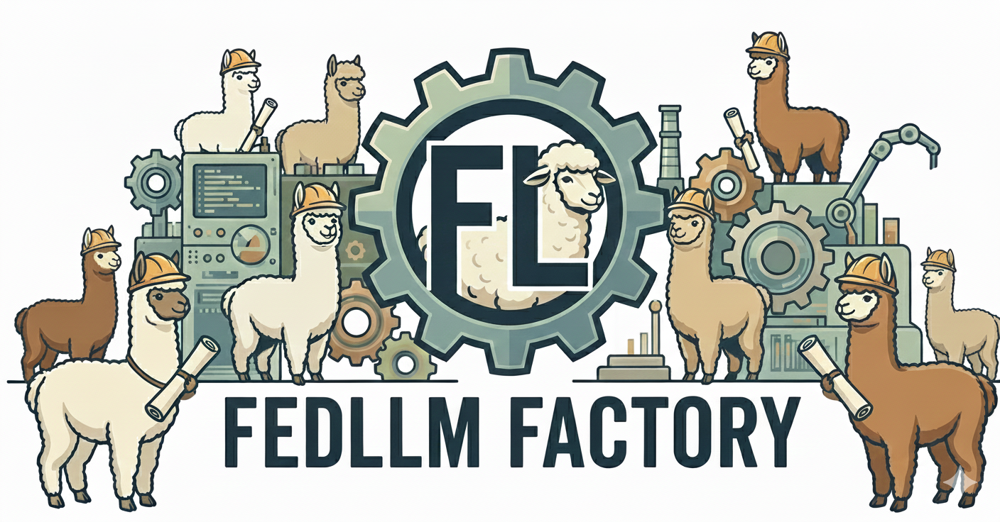
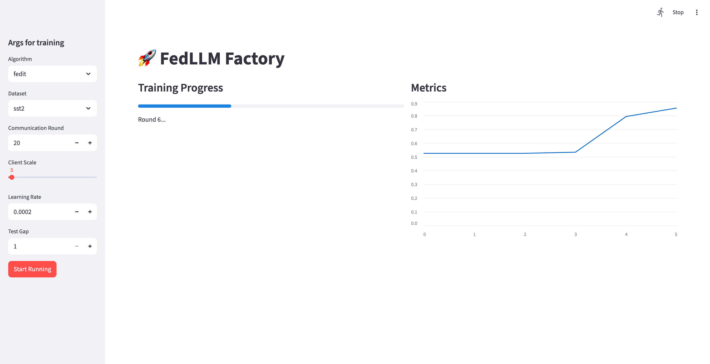

# FedLLM Factory

FedLLM Factory is a unified library for LoRA-based federated LLM fine-tuning.


### Supported Methods
Currently, it supports following 10+ baselines:

+ **FedIT**. Towards Building the Federated GPT: Federated Instruction Tuning. _ICASSP 2024_.
+ **FFA-LoRA**. Improving LoRA in Privacy-preserving Federated Learning. _ICLR 2024_.
+ **FLoRA**. FLoRA: Federated Fine-Tuning Large Language Models with Heterogeneous Low-Rank Adaptations. _NeurIPS 2024_.
+ **FlexLoRA**. Federated Fine-tuning of Large Language Models
under Heterogeneous Tasks and Client Resources. _NeurIPS 2024_.
+ **FedDPA**. Dual-Personalizing Adapter for Federated Foundation Models. _NeurIPS 2024_.
+ **FedSA-LoRA**. Selective Aggregation for Low-rank Adaptation in Federated Learning. _ICLR 2025_.
+ **FedEX-LoRA**. Exact Aggregation for Federated and Efficient
Fine-Tuning of Foundation Models. _ACL 2025_.
+ **FedSVD**. FedSVD: Adaptive Orthogonalization for Private Federated Learning with LoRA. _NeurIPS 2025_.
+ **RAVAN**. RAVAN: Multi-Head Low-Rank Adaptation for Federated Fine-Tuning. _NeurIPS 2025_.
+ **RoLoRA**. Robust Federated Finetuning of LLMs via Alternating Optimization of LoRA. _NeurIPS 2025_.
+ **FedLEASE**. Adaptive LoRA Experts Allocation and Selection for Federated Fine-Tuning. _NeurIPS 2025_.
+ **SLoRA**. SLoRA: Federated Parameter Efficient Fine-Tuning of Language Models. 2023.
+ **ILoRA**. ILoRA: Federated Learning with Low-Rank Adaptation for Heterogeneous Client Aggregation. 2025.
+ **FedRotLoRA**. FedRot-LoRA: Mitigating Rotational Misalignment in Federated LoRA. 2026.
+ **HiLoRA**. HiLoRA: Hierarchical Low-Rank Adaptation for Personalized Federated Learning. 2026.
+ **FedMomentum**. FedMomentum: Preserving LoRA Training Momentum in Federated Fine-Tuning. 2026.

Also, we support asynchronous version of federated LLM tuning.
To implement an asynchronous federated LLM fine-tuning algorithm, you can extend `asyncftbase.py`.

### General Steps
#### Step 1: Generate Dataset
You can split the dataset required for training.

1. Edit `dataset/config.yaml`.
2. Run `generate_{your dataset}.py` to generate your dataset.
```
cd dataset
python generate_{your dataset}.py
```

#### Step 2: Fine-tune Model
1. Edit `config.yaml`.
2. Run `main.py` for fine-tuning.
Note that you can attach args. 
The attached args will cover the parameters set in `config.yaml`. For example,
```
python main.py --alg fedit --epoch 1
```
The args can be configured in `utils/options.py`. 

### Supported Datasets
#### Natural Language Understanding (NLU)
+ **SST-2**
+ **IMDB**
#### Question Answering (QA)
+ **Dolly**
#### Mathematical Reasoning
+ **GSM8K**
+ **SQuAD v1.1** (centralized LoRA validation subset: 10,000 train / 2,000 test)

### SQuAD v1.1 centralized validation

Download and deterministically prepare the SQuAD v1.1 subset under
`dataset/squad_v1`, then run the one-client, one-round centralized baseline:

```
python -X utf8 dataset/prepare_squad_v1.py
python -X utf8 main.py --config config.squad_v1.yaml
python -X utf8 eval.py --config config.squad_v1.yaml
```

The 10,000 examples come from the official training split and the 2,000 test
examples come from the official validation split.  `manifest.json` records the
source checksums and sampling seed.  This command evaluates per-round loss and
perplexity; the final evaluation additionally reports SQuAD-style EM and F1
against all official answer spans.

SQuAD training and evaluation use the same Qwen3 chat template with
`enable_thinking=False`. Answers are supervised through `<|im_end|>`, context
is the only truncatable prompt field, and final generation uses deterministic
greedy decoding rather than the model's sampling defaults. Final evaluation
uses the official SQuAD normalization/EM/F1 definitions and saves each decoded
answer under `exp/<suffix>/evaluation/squad_v1/client_0_predictions.jsonl`.
Aggregate EM and F1 are reported on the official 0–100 percentage scale.
The SQuAD config fixes `seed: 42` and enables deterministic PyTorch/CUDA
algorithms. Python, NumPy, PyTorch, LoRA initialization, client sampling, and
per-client/per-round DataLoader shuffling are all seeded; the resolved training
configuration is saved beside each LoRA checkpoint as `training_config.json`.
SQuAD context windows are centred using the dataset's official `answer_start`
offsets; both original and window-relative offsets are retained in JSONL and
validated during preparation.

### SQuAD v1.1 FedIT baseline

Prepare a deterministic IID partition with five clients, then run FedIT:

```
python -X utf8 dataset/prepare_squad_v1_federated.py
python -X utf8 main.py --config config.squad_v1_fedit.yaml
python -X utf8 eval.py --config config.squad_v1_fedit.yaml
```

The partition contains exactly 2,000 training examples per client and no
client-local test split. All five clients participate in every communication
round. After aggregation, the global model is evaluated once on the shared
2,000-example SQuAD validation subset. Per-round evaluation reports
token-weighted loss/perplexity and official deterministic EM/F1, and saves
auditable predictions under
`exp/squad_v1_fedit_5clients/evaluation/squad_v1_fed5/`. The standalone
evaluation command reloads the saved global adapter and evaluates the same
shared test set once.


### Cross-domain MRQA QA pilot: FedIT vs. FedRot-LoRA

This controlled pilot gives four fully participating clients the same
extractive-QA instruction format but different MRQA domains: client 0 SQuAD,
client 1 NewsQA, client 2 TriviaQA, and client 3 NaturalQuestions. It uses the
existing Qwen3 chat template, answer-only label masking, deterministic greedy
generation, and SQuAD/MRQA multi-reference EM/F1 normalization. The only
training-method difference is aggregation: FedIT averages LoRA factors and
FedRot-LoRA aligns them before applying that same equal-weight average.

Install the normal project dependencies (plotting additionally uses
`matplotlib`), then prepare data:

```
pip install -r requirements-stage1.txt matplotlib
python -X utf8 dataset/prepare_cross_domain_mrqa.py
```

The preparation command downloads the official, already unified MRQA v2
JSONL.GZ train and validation files, samples exactly 1,000 train and 200
held-out test examples per domain with seed 42, and writes
`dataset/cross_domain_mrqa/`. It preserves named test identities instead of
creating a mixed global test file. `manifest.json` records source URLs,
original splits, SHA-256 hashes, seeds, and output counts;
`statistics.json` records train/test counts plus average prompt/input, context,
question, and answer token lengths. The supervised answer is the first
source-order gold answer found in its context; all gold strings remain in
`answers` for evaluation.

Run the two otherwise identical ten-round experiments:

```
python -X utf8 main.py --config config.cross_domain_fedit.yaml
python -X utf8 main.py --config config.cross_domain_fedrot.yaml
```

All four clients participate every round. Aggregation follows the repository's
existing training-sample-count weighting; because every client has 1,000
examples, this is exactly 1/4 per client in this pilot. After every
aggregation, the run writes a snapshot at
`exp/<suffix>/adapter/.../round_XXX/lora_weights.pt`, generates
predictions separately for SQuAD, NewsQA, TriviaQA, and NaturalQuestions, and
writes per-domain rows plus a macro row to:

```
exp/<suffix>/evaluation/cross_domain/results.csv
exp/<suffix>/evaluation/cross_domain/macro_average.csv
```

EM, F1, and containment in these CSVs are percentages on the existing SQuAD
0--100 scale. Prediction JSONL files retain every reference answer and each
example-level score. Re-evaluate saved adapters (for example after changing
only evaluation hardware) or plot the round curves with:

```
python -X utf8 eval_cross_domain.py --config config.cross_domain_fedit.yaml --rounds all
python -X utf8 eval_cross_domain.py --config config.cross_domain_fedrot.yaml --rounds all
python -X utf8 plot_cross_domain_results.py
python -X utf8 bootstrap_cross_domain_f1.py --rounds all
```

The plot command creates `exp/cross_domain_mrqa_f1_by_round.png`, with one F1
trajectory per domain and method. The standalone evaluator intentionally
rewrites its method's `results.csv`, so run it once with `--rounds all` when a
complete replacement is wanted.

`bootstrap_cross_domain_f1.py` resamples the 200 examples inside each domain,
not the four domain means. Its CSV includes each method's F1 bootstrap standard
deviation and a paired FedRot-LoRA minus FedIT 95% interval; the latter
quantifies evaluation-set uncertainty for a method difference, but does not
replace multiple-training-seed uncertainty. By default it also evaluates the
per-example mean across all selected rounds, which is the appropriate row for
claims based on a ten-round average rather than a single checkpoint.

#### Centralized pooled-data reference

Build a deterministic 4,000-example training pool from the same four client
files, then run and optionally re-evaluate the centralized LoRA reference:

```
python -X utf8 dataset/build_cross_domain_pooled.py
python -X utf8 main.py --config config.cross_domain_centralized.yaml
python -X utf8 eval_cross_domain.py --config config.cross_domain_centralized.yaml --rounds all
```

This does not mix the 800 test examples into one metric. The same four named
200-example test sets are evaluated independently and macro-averaged. The
centralized run uses one pooled client, 10 rounds, and 500 optimizer updates
per round. With `bs=1` and `grad_accum=8`, this matches the federated runs'
40,000 total example exposures and 5,000 optimizer updates while retaining the
same round-wise learning-rate schedule. Its outputs are stored under
`exp/cross_domain_mrqa_centralized/` with method label `centralized`.

### Frontend Usage
We also provide a simple frontend for users to easily run the code.
To use the frontend, you should install `streamlit` first.
Then, you can run the frontend by
```
streamlit run webui.py    
```

Then you can select the dataset, method, and other parameters in the frontend and click the "Start Running" button to start the fine-tuning process.




### To-Do List
+ Add more datasets, e.g., MMLU, C4, etc.
+ Add more baselines, scaling to 20+
+ Add more evaluation metrics, e.g., ROUGE, BLEU, etc.
+ Support rank heterogeneity
